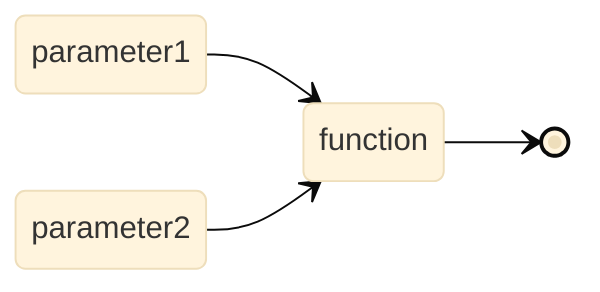
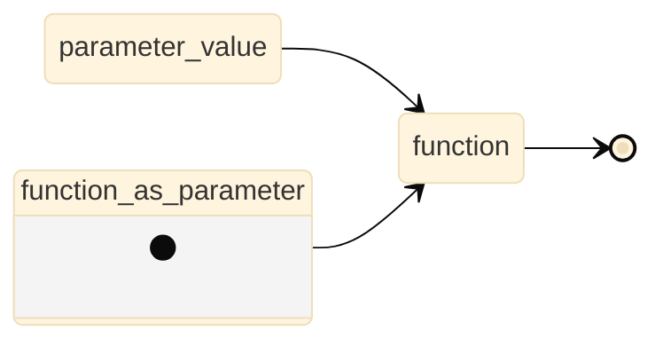
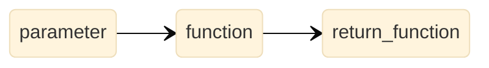

## 概述

这篇文章里，我们将讨论一个函数式编程的重要概念，「函数是一等公民」，顺便引出科里化、Partial Applied Function、多元函数的概念。

## 多元函数

第一个我们要介绍的是多元函数的概念。其实多说无益，多元函数就是有超过一个参数的函数，它的「水管图」可以概括如下：



这个是对水管的另一个扩展，我们从此可以合并两个分支了。

## 作为参数的函数

下面，当然是我们对一等公民的第一个表述，就是我们可以将函数作为参数带入到另一个函数中。如下所示，此时我们得到了水管功能的扩展。一个水管可以作为另一个水管的组成存在了。



这样操作最大的好处是，我们能对函数（运算）本身进行抽象处理了，譬如我们上一章实现的`compose`命令就是一个非常典型的例子。他们是对一元函数本身的抽象思考。

我们这里举个例子，就是我们要按照一个列表的顺序来计算列表里每个二维点之间的欧式距离，可以写成下面的函数：

```python
import math

def euclidean_distance_between_two_ls(ls1, ls2):
    euclidean_distance_between_two_point = lambda x, y: math.sqrt((x[0] - y[0]) ** 2 + (x[1] - y[1]) ** 2)
    return [euclidean_distance_between_two_point(i, j) for i, j in zip(ls1, ls2)]
```

在完成这个例子时，我们很快就能发现，这个函数不止可以算欧式距离，可以抽象为为所有距离公式都可以计算的函数：

```python
def distance_between_two_ls(ls1, ls2, distance_func):
    return [distance_func(i, j) for i, j in zip(ls1, ls2)]
```

如果你是一个数据工作者，应该可以警觉的发现，这种思路也可以用才方便地替换「相关性」、「神经元函数」、「词干化方法」等各种领域中。

## 作为返回值的函数

下面是我们对水管的下一步扩展，也是作为函数第一等公民的下一个体现，即函数作为返回值，大致的水管图如下：



这个做的好处，我们依旧可以延续上面的说法，我们对函数和运算做了更高层级的抽象。当然排除掉这一点，在实用层面上说，这么做可以产生两个Tips，提前计算和延迟计算。

我们来考虑下面这个例子：

```python
one = lambda : 1
```

这个例子中，我们需要靠`one()`来得到实际的数值`1`，这个就是最小的延迟计算的例子。当然，我们在后面的例子中，将要通过这个来实现一个基于皮亚诺公理的自然数集的概念。当然更多情况里，延迟计算体现在我们只是通过一部分参数来产生一个水管而不是一个具体值，最后通过调用水管来参与计算。我们在前一章的`compose`中也体现了这个思想，我们只是拼装水管成新水管，而不是直接调用。

当然，我们因此也可以做到「提前计算」或者说保存状态的概念。比如下面一个例子：

```python
def f(x, y):
    z = x ** 2 + x + 1
    return y * z
```

如果我们经常要用到`x = 1`的情况，显然，做成返回函数的方法更有效。我们可以将这个与面向对象的概念中如何存储更新一个对象的属性联系在一起。下面的策略实际上是函数式编程**保存状态**的最基本的方法，我们保存了`x`等于某个值的状态（类比我们保存了一个叫「李华」的学生的年龄，注意我们就不需要实例化、方法、属性的概念了，我们只有函数、函数、函数）。

```python
def f(x):
    def helper(y):
        z = x ** 2 + x + 1
        return y * z
    return helper
```

这个过程我们也叫**科里化**（Currying），但是科里化的定义非常严格，就是每次只传入一个参数，这样我们可以一直复用`x = 1`的情况了：

```python
f1 = f(1)

# 调用
f1(2)
f1(3)
```

如果单纯地这么做，我们可以用`functools.partial`来改写已经维护好的多元函数。

```python
from functools import partial

def f(x, y):
    z = x ** 2 + x + 1
    return y * z

f1 = partial(f, 1)

f1(2)
f1(3)
```

但作为性能调优，这种看起来函数里面套函数的写法有另外一个好处，就是前面说的「提前计算」。比如上面的例子里，明显当`x`带入后，`z`是可以马上计算出来的，不需要等`y`的传入。并且，我们发现每一次调用`f1`的时候，`z`都计算了一次。于是，我们可以看到作为返回值函数的另一个特性。下面的函数就展示了作为返回值的函数的所有技巧和好处。这种函数也被称为Partial Applied Function或简称为Partial Function（注意和001中数学定义的偏函数的区别）。

```python
def f(x): # x储存了某种我们需要的状态
    ## 所有可以提前计算的放在这里
    z = x ** 2 + x + 1
    def helper(y):
        ## 所有延迟计算的放在这里
        return y * z
    return helper
```

## 总结

作为一等公民的函数的表现：

1. 我们只有作为水管的函数和进入水管的水两个概念；
2. 函数可以作为参数传入另一个函数；
3. 函数可以作为另一个函数的返回值；

我们把具有2、3特征中至少一个的函数称为高阶函数。高阶函数的一些优势包括：

1. 仅需要函数和值的概念，就能保存状态。而不需要更多诸如实例化、对象、可变变量、属性等概念；
2. 可以延迟计算，达到最基本的「惰性」的概念。
3. 可以提前计算，达到更高效率地复用代码块。


