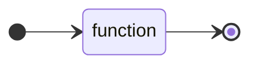
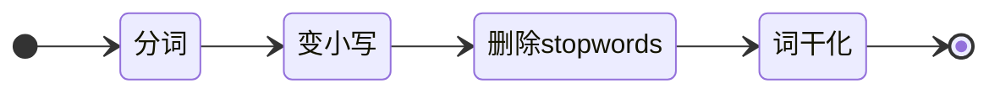

## 水管模型

这一章，我们要回到一个问题，到底函数式和过程式的编程思路到底在哪里？我们这里提供一个形象的比喻。

### 过程式--屋子物件

过程式思维里，每一个可变变量、函数/过程指称的符号，类似告诉你一个屋子的名字。对一个静态语言来说，我们可能还需要屋子里只能放什么东西。然后，我们每一次调用一次函数/过程，就是将对对应屋子里的函数取出来，以及其他屋子里的物件取出来，按照函数的方式重新整理，把结果放到原先的屋子或者新的屋子里。（注意这个描述和图灵机其实是类似的。）

但是，这个屋子可能会更复杂，我们可能有时候会参考别的屋子里的情况，甚至另一栋房子里的屋子（其他模块、第三方插件），或者甚至是天气和社会新闻（环境变量、硬件）来盘算每一次整理物件的逻辑（即函数）。这个是「屋子-物件」模型中，最让人困惑的事。如果你天气不好，或者别的屋子的情况有问题，你的整理物件的规则可能就有很大的问题，而且溯因是困难的。这个我们也在001中介绍过这个问题。

### 函数式--水管和数据流

在函数式编程中，我们的模型是编造一些列的水管，水管就是函数式中的函数。我们的目标就是事先将各种函数水管给架设好管道系统。然后将水（数据/不可变参数）倒入进去，等待水管的另一头流出结果就好了。就像下面的图显示的那样：



## compose

我们到目前为止，可以想到的最简单的就是将水管相连。比如，在做文本处理的时候，我们很有可能会有以下的操作。这个就是典型的水管拼接的过程，我们只需要维护**分词**、**变小写**、**删除stopword**、**词干化**这几个函数即可。



当然，我们可以一步步把水倒到水管里，取出来再倒到另一个水管。那何不我们就直接事先帮水管串起来。这个操作也被称为`compose`(用符号$$\circ$$表示)，数学表述如下：

$$(f \circ g) x = f(g(x))$$

我们给出一个简单的`Python`实现：

```python
from functools import reduce

def compose(*args):
    """数学中的compose

    >>> from fppy.base import compose
    >>> compose(lambda x: x+1, lambda x: x**2)(1)
    >>> 4

    """
    return reduce(lambda f, g: lambda x: f(g(x)), args, lambda x: x)
```

比如我们就可以把下面的`f1`、`f2`、`f3`给串起来了：

```python
>>> f1 = lambda x: x + 1
>>> f2 = lambda y: y * 2
>>> f3 = lambda z: z / 3

>>> compose(f3, f2, f1)(1)
1.3333333333333333

>>> h(g(f(1)))
1.3333333333333333

```

不过有时候，`compose`的顺序会让人困惑，我个人喜欢下面`and_then`的表述：

```python
def and_then(*args):
    return reduce(lambda f, g: lambda x: g(f(x)), args)
```

对我个人而言这样子会更明确：

```python
>>> and_then(f, g, h)(1)
1.3333333333333333
```

不过在具体实现里，我们其实用到了作为参数的函数的概念，这个也是函数式编程中「函数是一等公民」的表现，具体各种水管模式（听起来我们是长胡子的法国水管工）我们将在下面的文章中一一展现。
