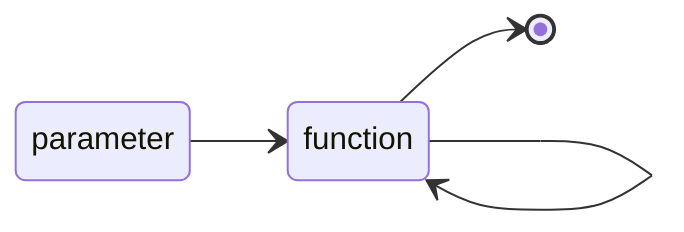

## 从递推说起

说到代码复用，最低层次的代码复用就是基于`for`/`while`等的递推(iteration)思路了，它们的策略在代码行的重复，我们可以看一下下面求幂的例子（这个例子将在之后会以各种面目出现）：

```python
def power1(x: float, n: int) -> float:
    res = 1
    for i in range(n):
        res *= x
    return res
```

这个例子不能全然地用纯函数的方式实现，因为如果我们打印出`i`和`res`的取值，会发现`i`和`res`的都一直在变化。不过，单就从实现一个函数而言，其实`i`和`res`都是局部变量，我们很大地限制了变量在函数外发挥作用。其实这种方式地使用「可变值」或者「副作用」的方式，我们在后面探讨「不纯地函数式」中也会容许这种事情的发生。

但是，如果`res`和`i`不止出现在了这么一个小范围的函数里，而是整个大的模块代码块中，那么`i`和`res`的副作用就不容忽视了。

## 递归

回到这一篇的主题，如果单纯只用到函数的概念而没有环境的概念，我们就需要下一个水管形状了，一个自引用的循环，类似一个带环的水管。当然这个水管不能是没有出口和没有入口的莫比乌斯。



我们把这种函数自我引用称为递归(recursion)。当然，递归并不意味着没有副作用，甚至递归和函数式编程也没有必然的关联，过程式中依旧可以使用递归。但是如果纯函数式编程，如果要想实现类似循环/复用的概念，递归是一个最基本的操作（后面也会介绍其他种类的循环的概念）。

上面求幂的函数，我们可以很简单地实现为：

```python
def power2(x: float, n: int) -> float:
    if n == 0:
        return 1
    else:
        return x * power2(x, n - 1)
```

## 尾递归

讲到递归，我们可能就要提到递归的第一种优化方案，即尾递归的方法。递归在执行上速度非常不能让人满意的就是，诸如上面的幂运算中，要到最后算到`power2(x, 1)`的时候才能真的发生运算，之前都是在做表达式展开（或者说堆栈）的工作。譬如，对于计算`power2(2.0, 5)`时，经历了如下展开和计算的操作：

```python
power2(2.0, 5)
2.0 * power2(2.0, 4)
2.0 * (2.0 * power2(2.0, 3))
2.0 * (2.0 * (2.0 * power2(2.0, 2)))
2.0 * (2.0 * (2.0 * (2.0 * power2(2.0, 1))))
2.0 * (2.0 * (2.0 * (2.0 * (2.0 * power2(2.0, 0)))))
2.0 * (2.0 * (2.0 * (2.0 * (2.0 * 1.0))))
2.0 * (2.0 * (2.0 * (2.0 * 2.0)))
2.0 * (2.0 * (2.0 * 4.0))
2.0 * (2.0 * 8.0)
2.0 * 16.0
32.0
```

一个解决方案就是让它立即求值，这个对于求值优先而不是展开优先的语言来说（提速了堆栈的部分时间），就能提速很多。此时我们需要一个保存临时值的量，来保存即时计算的结果，如下：

```python
def power3(x: float, n: int, acc: float = 1.0) -> float:
    if n == 0:
        return acc
    else:
        return power3(x, n - 1, acc * x)
```

对于一个优先求值的编译器来说，它的计算顺序如下：

```python
power3(2.0, 5, 1)
power3(2.0, 4, 1 * 2.0)
power3(2.0, 4, 2.0)
power3(2.0, 3, 2.0 * 2.0)
power3(2.0, 3, 4.0)
power3(2.0, 2, 4.0 * 2.0)
power3(2.0, 2, 8.0)
power3(2.0, 1, 8.0 * 2.0)
power3(2.0, 1, 16.0)
power3(2.0, 0, 16.0 * 2.0)
power3(2.0, 0, 32.0)
32.0
```

很遗憾的是，在`CPython`中，这个还是会有堆栈问题，`PyPy`则是欢迎这种尾递归的优化。你可以通过第三方模块实现这个尾递归的操作。也有[博客(https://towardsdatascience.com/python-stack-frames-and-tail-call-optimization-4d0ea55b0542)](https://towardsdatascience.com/python-stack-frames-and-tail-call-optimization-4d0ea55b0542)提供了自己的一个修饰器的实现。

```python
import inspect

def tail_rec(func):
    rec_flag = False
    targs = []
    tkwargs = []
    def helper(*args, **kwargs):
        nonlocal rec_flag
        nonlocal targs
        nonlocal tkwargs
        f = inspect.currentframe()

        if  f.f_code == f.f_back.f_back.f_code:
            rec_flag = True
            targs = args
            tkwargs = kwargs
            return
        else:
            while True:
                try:
                    result = func(*args, **kwargs)
                except TypeError as e:
                    raise Exception("It is possible that the decorated function is not tail recursive")
                if rec_flag:
                    rec_flag = False
                    args = targs
                    kwargs = tkwargs
                else:
                    return result
    return helper
```

这样，我们上面的幂函数就可以这个修饰器来达到无栈的尾递归版本：

```python
@tail_rec
def power4(x: float, n: int, acc: float = 1.0):
    if n == 0:
        return acc
    else:
        return power4(x, n - 1, acc * x)
```

当然，有时为了掩藏这个`acc`的参数不要用户调用，我们也可以使用高阶函数的方法，把它包裹起来，这样，`acc`就有点类似私有属性一样被隐藏起来，防止使用者错误或者误解如何使用了。

```python
@tail_rec
def power5(x: float, n: int):
    def helper(x: float, n: int, acc: float):
        if n == 0:
            return acc
        else:
            return helper(x, n - 1, acc * x)
    return helper(x, n, 1.0)
```

使用时即像`power1`一样调用就可以了，这样我们就发现了函数作为返回值的另一个好处（掩藏私有变量）了：

```python
>>> power5(2.0, 5)
32.0
```

### 附：其他优化方案

我们在之后的修饰器和缓冲的内容中，将会介绍如何记忆结果减少重复计算的方法。

## 结语

这篇文章之中，我们学到了多元函数、作为参数的函数、作为返回值的函数之外的第四种水管，一个自我引用的环形水管，用此来在函数式的范围内解决了需要代码服用/循环这一问题。


