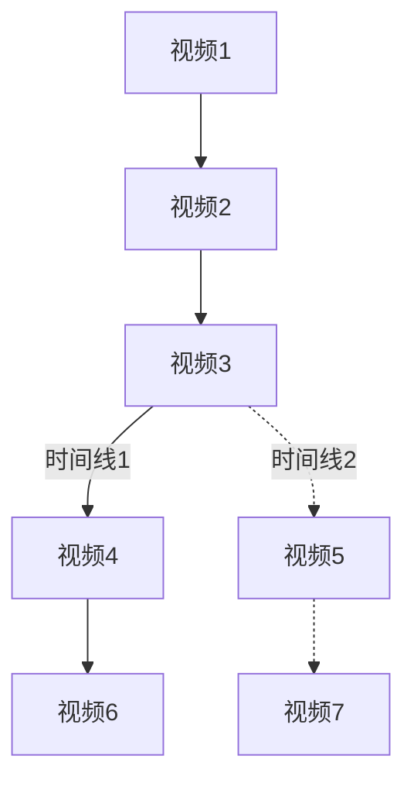

> 这张巨网（在其中，种种时间或者相互接近，或者出现分岔，或者戛然而止，或者在数个世纪里互相好污觉察）囊括了时间的所有可能性。
>
> ----博尔赫斯《小径分岔的花园》

抖音，让人们活在了字面上的「Hyper-reality」组成的世界中，推荐系统完成了一项神秘的事务。一条条短时间的运动影像和运动影像之间产生了神秘的联系，我们的拇指在少数时间作为一个剪辑师而存在，但推荐系统却成为了真正的隐性蒙太奇。短视频和短视频之间，竟然形成了一种超越了帧与帧之间的更宏观的时间结构。一个更为明朗的念念相续。影像变成了一个「德勒兹式」的生成式图景，无限涌动着，让我们的意识图流成为一个欲望的永动机。推荐系统成为了「模式本身」，成为梦的结构本身。数据库中几乎无限的短视频，变成了无限的时间、记忆、潜意识。

如果这个假设和博尔赫斯的时间图景类似的话，那么一段段埋藏在数字海洋中的记忆，通过某种联系，成为一个一个完整的时间线。我们的每次选择，就会再某种程度上重写新的时间线。

我们在探索新的民意体制的今天，似乎要同时看到这个新的图景。如果说未来在无限的宇宙之海里面选择，那么「网状」的民主结构，是否意味着纯然的自由。是否是后现代主义的美好乌托邦。答案在这里变成了一种新的悬置。「推荐系统」成为意识形态本身，正如《监视资本主义：智能陷阱》所要探索的智慧牢笼。好的意识形态本身本来就是生成性的，一种可矫正的民主。一方面我们在所谓的自由和繁盛的可能性中沾沾自喜，一方面却没想到现在的匮乏的线路本身。迷宫中是否存在一个不可到达的屋子？

《黑镜：潘达斯奈基》本质上是一次理念性的失败。《黑镜》往期剧集以一种单元剧式的方式存在，彼此之间只有某种隐喻层面的勾连。这是一种碎片记忆的展现。而《黑镜：潘达斯奈基》则从整个结构上打破这种记忆结构，但是却落入到了另一个可能性窠臼。这个窠臼本质上与抖音在形而上层面上的企图是类似的。我们越陷越深地落入到无限地自我生成的图像之中，为一些可笑的自由沾沾自喜。

游戏从某个层面再进行一次影像上的倒推，「时间-影像」的图景推缩成了描述「互动性」的「运动影像」本身。Vertov企图通过摄像机来脱离一种日常的受限的思维和认知模式，新现实主义让意识在远景处的逗留，都回归到一种「具身性」的自动生成本身。

真理本身也许不是永恒性的规则，而是「事件」的产生，一种打破受限的认知、感知模式。到了抖音这里，「心不相应法」变成了「心相应法」，这种破坏性的事件越来越难以达成。事件不是电影中的反转，而是《惊魂记》中的浴室杀人，刹那之间，时间线被彻底重写。苦难也许是一种永恒轮回，但在抖音的世界里，这个欲念被一直拉长至一个无限长的影像序列中。断裂本身却在游戏发生bug时完全出现，我们「出戏」了，「间离」了，我们看到时间的裂痕，帧与帧的联系无法维系信念。我们看到了穿过墙体的身体，悬浮在空中的汽车。我们需要重启这一切，让真相不再出现，我们不需要意外。我们需要的就是永恒自我生成的运动影像本身。

欲念似乎只有等量级的变化。我们却在搜索引擎中看的它几何式地迸发。求知欲就是欲念本身。电影，回到电影，一些科幻片会出现一个绝对性时刻。它们展现了某种四圣諦的哲学。譬如《2001太空漫游》，黑方石的出现成为符号界无法触碰到的匮乏本身（苦）；技术进步确实这种所谓「求知欲」欲念的集起（集）；谋杀科学本身的最极端产物HAL 9000（灭）；坠入到无所描述的黑方石本身（道）。《灯塔》《湮灭》也都在以同样的叙事结构展现这个欲念的量级层面的变化。甚至《春光乍泄》也有类似的结构，欲念是「依他起」，是何宝荣的那句话，欲念是大瀑布的灯。粘腻之后，却是独自站在大瀑布涅槃前的空无。

PornHub有着和抖音一样的纯粹记忆存储本身，却主要以搜索引擎的方式展开。人们的欲念的量级伴随着生理需求，变成了对关键字的越来越精确描述，慢慢放大。直到最后，即使完成了欲望的释放，似乎语词本身也是虚空的。它不是我们想要的。我们心里有点空虚地觉得。因为欲望就是缺乏本身。

2077里的所有情节，不过是另一个时间性的牢笼。


